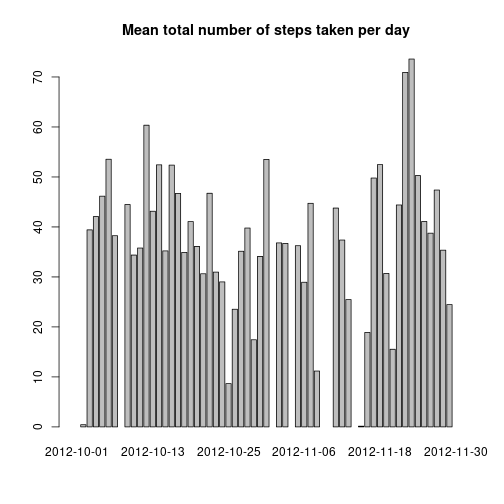

## Loading libraries


```r
library(ggplot2)
library(gridExtra)
library(plyr)
library(dplyr)
```


## Loading and preprocessing the data

#### 1. Set up directory for downloading data:

```r
dir.create("./data", showWarnings = FALSE)

downloadURL <- "https://d396qusza40orc.cloudfront.net/repdata%2Fdata%2Factivity.zip"
downloadedFile <- "./data/activity.zip"
```

#### 2. Download and unzip data:

```r
if(!file.exists(downloadedFile)) {
    download.file(downloadURL, downloadedFile, method = "curl")
    unzip(downloadedFile, exdir = "./data")
}
```

#### 3. Load data to environment:

```r
df <- read.csv(file = "./data/activity.csv", header = TRUE)
```

#### 4. Convert date feature to DateTime format:

```r
df$date <- as.Date(df$date, "%Y-%m-%d")
```

#### 5. Take a quick look of our data:

```r
head(df)
```

```
##   steps       date interval
## 1    NA 2012-10-01        0
## 2    NA 2012-10-01        5
## 3    NA 2012-10-01       10
## 4    NA 2012-10-01       15
## 5    NA 2012-10-01       20
## 6    NA 2012-10-01       25
```


## What is mean total number of steps taken per day?

#### 1. Calculate the total number of steps taken per day:

```r
total.steps <- tapply(df$step, df$date, sum)
```

#### 2. Histogram of the total number of steps taken per day:

```r
histogram.steps <- qplot(total.steps,
                         geom = "histogram",
                         bins = 10,
                         main = "Total steps taken per day",
                         xlab = "Steps")
histogram.steps
```

```
## Warning: Removed 8 rows containing non-finite values
## (stat_bin).
```


#### 3. The mean and median of the total number of steps taken per day:

*Mean total number of steps taken per day:*

```r
mean.steps <- tapply(df$steps, df$date, mean)
barplot(mean.steps, main = "Mean total number of steps taken per day")
```


&rarr; The minimum value for the mean of the total number steps is very low with 0.14. Otherwise, the maximum value is 73.59 which is very high value for this figure.

*Median total number of steps taken per day:*

```r
median.steps <- tapply(df$steps, df$date, median)
boxplot(median.steps,  main = "Mean total number of steps taken per day")
```


&rarr; The median values for all of the dates are the same with 0. 
It means, for each date, there are more than 50% of the time that the enthusiasts did not take any steps.


## What is the average daily activity pattern?

*Calculate average number of steps taken per day:*

```r
avarage.steps <- df %>%
    group_by(date) %>%
    summarise(mean(steps)) %>%
    rename("steps" = "mean(steps)")
```

*Time series plot:*

```r
ggplot(data = avarage.steps, aes(x = steps, y = date)) +
    geom_line() +
    xlab("avarage steps") +
    ggtitle("Time series plot") +
    annotate("segment", 
             x = avarage.steps[which(avarage.steps$steps == max(avarage.steps$steps, na.rm = TRUE)), "steps"][[1]] + 1,
             xend = avarage.steps[which(avarage.steps$steps == max(avarage.steps$steps, na.rm = TRUE)), "steps"][[1]] + 1,
             y = avarage.steps[which(avarage.steps$steps == max(avarage.steps$steps, na.rm = TRUE)), "date"][[1]],
             yend = avarage.steps[which(avarage.steps$steps == max(avarage.steps$steps, na.rm = TRUE)), "date"][[1]],
             arrow = arrow(), 
             color = "blue")
```

```
## Warning: Removed 8 row(s) containing missing values
## (geom_path).
```


&rarr; From the plot, the day Dec 23 has the highest average number of steps within 5 minutes.


## Imputing missing values

#### 1. Calculate the total of missing values:

```r
summary(df)
```

```
##      steps             date               interval     
##  Min.   :  0.00   Min.   :2012-10-01   Min.   :   0.0  
##  1st Qu.:  0.00   1st Qu.:2012-10-16   1st Qu.: 588.8  
##  Median :  0.00   Median :2012-10-31   Median :1177.5  
##  Mean   : 37.38   Mean   :2012-10-31   Mean   :1177.5  
##  3rd Qu.: 12.00   3rd Qu.:2012-11-15   3rd Qu.:1766.2  
##  Max.   :806.00   Max.   :2012-11-30   Max.   :2355.0  
##  NA's   :2304
```
&rarr; In the data set, only the column of ```steps``` contains missing values with 2304 number. In other words, there are more than 13% NAs in this column.

#### 2. Strategy for filling the gaps:

Beside the simple methods like filling the gaps with the mean or median value of ```steps``` column, I will be replacing missing values in the column of ```steps``` with the Median per group of interval.

#### 3. Conduct the strategy:

*Steps to fill the gap:*

        + Using the ddply() function;
        + Specify the data frame that containg the missing values. In this case, the data frame is df;
        + Specify the column that define the groups. In this case, the column is interval;
        + Use the transform function;
        + Specify the column that contains the missing values. In this case, the column is steps;
        + Use the ifelse function to identify and replace the NAs with the median;
        + Finish the ddply() function.

```r
new.df <- ddply(df, 
            ~ interval, 
            transform,
            steps = ifelse(is.na(steps),
                           median(steps, na.rm = TRUE),
                           steps))
```

*Take a look at the tidy data set:*

```r
head(new.df)
```

```
##   steps       date interval
## 1     0 2012-10-01        0
## 2     0 2012-10-02        0
## 3     0 2012-10-03        0
## 4    47 2012-10-04        0
## 5     0 2012-10-05        0
## 6     0 2012-10-06        0
```

*Summary after filling the NAs:*

```r
summary(new.df)
```

```
##      steps          date               interval     
##  Min.   :  0   Min.   :2012-10-01   Min.   :   0.0  
##  1st Qu.:  0   1st Qu.:2012-10-16   1st Qu.: 588.8  
##  Median :  0   Median :2012-10-31   Median :1177.5  
##  Mean   : 33   Mean   :2012-10-31   Mean   :1177.5  
##  3rd Qu.:  8   3rd Qu.:2012-11-15   3rd Qu.:1766.2  
##  Max.   :806   Max.   :2012-11-30   Max.   :2355.0
```
&rarr; There is no missing values at all.

#### 4. Re-make histogram and re-calculate the mean vs median total number of steps taken per day:

*Histogram based on the total number of steps each day:*

Calculate the new histogram based on the new data sets:

```r
new.total.steps <- tapply(new.df$step, new.df$date, sum)
new.histogram.steps <- qplot(new.total.steps,
                             geom = "histogram",
                             bins = 10,
                             main = "New total steps taken per day",
                             xlab = "Steps")
```

Plot the old and new version of histogram:

```r
grid.arrange(histogram.steps, new.histogram.steps, nrow = 2)
```

```
## Warning: Removed 8 rows containing non-finite values
## (stat_bin).
```


&rarr; The two histograms look almost the same except for the ```steps``` with value 0.
The ```steps``` 0 go up from 2.5 to 10.

*Mean total number of steps taken per day:*

Calculate the new mean:

```r
new.mean.steps <- tapply(new.df$steps, new.df$date, mean)
```

Plot the barplots based on the old and new data sets:

```r
par(mfrow = c(2, 1))

barplot(mean.steps, main = "Mean total number of steps taken per day")
barplot(new.mean.steps, main = "New mean total number of steps taken per day")
```


&rarr; Overall, the mean total number of steps before and after filling the NAs do not change much.

*Median total number of steps taken per day:*

Calculate the new median:

```r
new.median.steps <- tapply(new.df$steps, new.df$date, median)
```

Plot the boxplots based on the old and new data sets:

```r
par(mfrow = c(2, 1))

boxplot(median.steps, main = "Median total number of steps taken per day")
boxplot(new.median.steps, main = "New median total number of steps taken per day")
```


&rarr; The two plots are identical.


## Are there differences in activity patterns between weekdays and weekends?

#### 1. Create a new factor indicating whether a given date is a weekday:

*Create a function indicating a given date is a weekdays:*

```r
check.weekday <- function(x) !(weekdays(x, abbreviate = TRUE) %in% c("Sat", "Sun"))
```

*Create ```weekday``` feature:*

```r
new.df$weekday <- sapply(new.df$date, check.weekday)
```

*Summary on the new ```weekday``` column:*

```r
summary(new.df$weekday)
```

```
##    Mode   FALSE    TRUE 
## logical    4608   12960
```

#### 2. Make the panel plot:


```r
p <- ggplot(new.df, aes(x = interval, y = steps, fill = weekday))
p <- p + geom_line() +
    facet_grid(weekday ~ .,
               labeller = labeller(weekday = c("TRUE" = "Weekday", "FALSE" = "Weekend"))) + 
    xlab("Interval") +
    ylab("Number of steps") +
    ggtitle("Time series plot")
p
```


